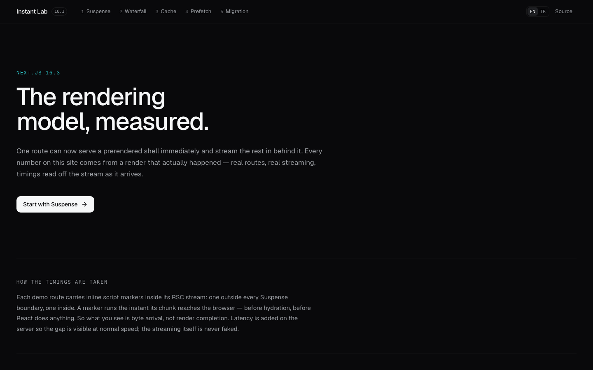
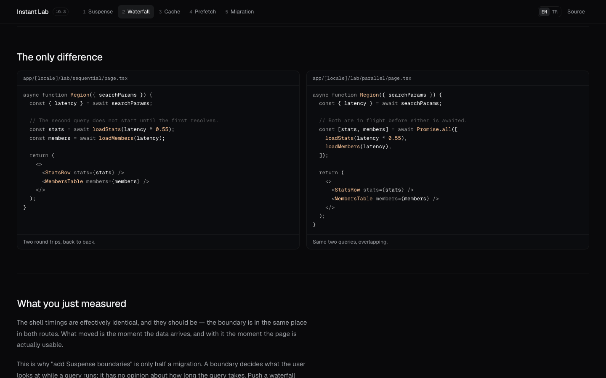
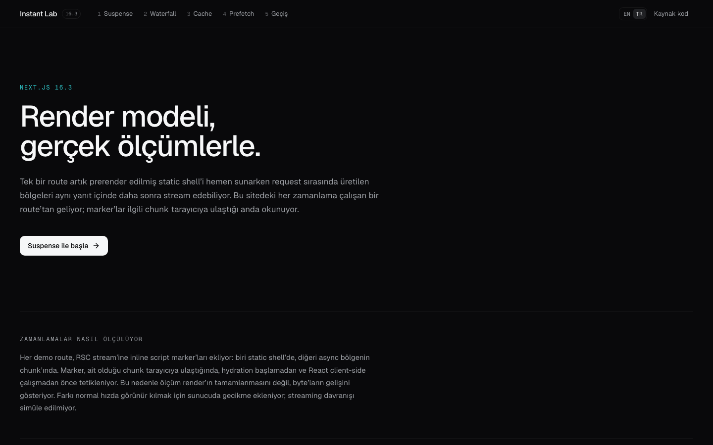
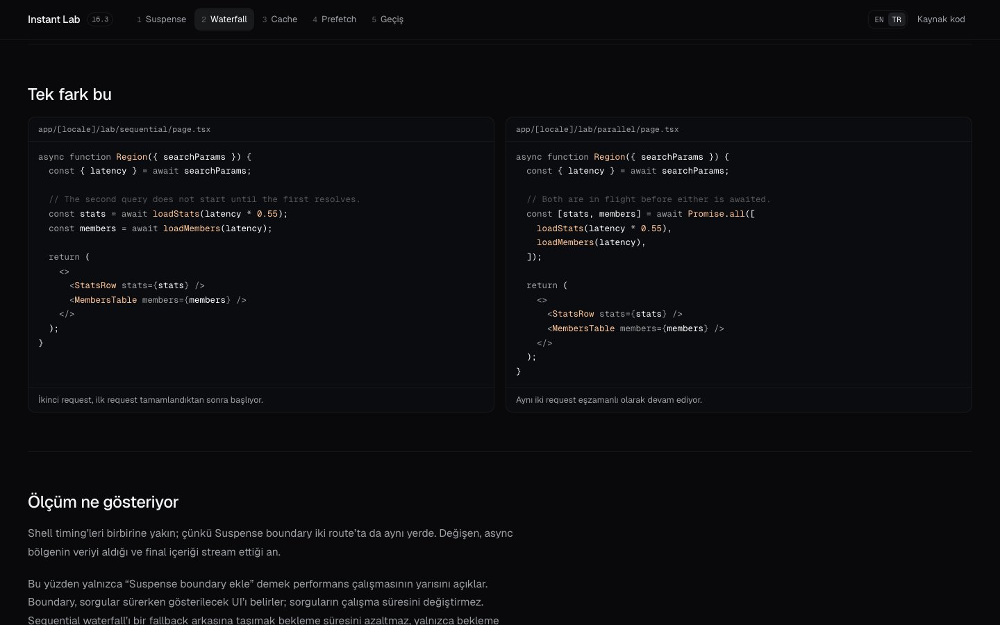

# Instant Lab

[English](#english) · [Türkçe](#türkçe)

<a id="english"></a>

## English

**The Next.js 16.3 rendering model, measured.** Instant Lab runs the model it explains: real routes, real RSC streaming, and timings read from the response as it reaches the browser. Only the added server latency is artificial.



### Quick start

```bash
pnpm install
pnpm dev
```

Requires Node.js 20+ and pnpm. Development mode is ideal for reading the code and exploring the first three chapters. Partial Prefetching is disabled in `next dev`, so use a production build for honest prefetch measurements:

```bash
pnpm build
pnpm start
```

### What this project proves

- **Suspense controls what waits, not how long the query takes.** Move an `await` behind a focused Suspense boundary and the static shell can arrive immediately while the async region streams later.
- **A boundary does not remove an async waterfall.** Sequential queries still cost the sum of both waits; starting them together costs roughly the slower query.
- **Cache Components moves the decision to the data.** `use cache`, `cacheLife`, and cache profiles determine which values can enter the prerender and App Shell.
- **Partial Prefetching shares one App Shell per route.** The lab records the requests and bytes behind plain and explicitly prefetched links.
- **One build can contain static, partial, and dynamic routes.** The migration chapter reads this repository's real build report instead of maintaining a hand-written table.



### Five chapters

| # | Chapter | What it demonstrates |
|---:|---|---|
| 1 | **Suspense** | The same query awaited at page level and inside a focused Suspense boundary. |
| 2 | **Waterfall** | Sequential and parallel async work behind identical boundaries. |
| 3 | **Cache** | `use cache`, `cacheLife`, prerender thresholds, `updateTag`, and `revalidateTag`. |
| 4 | **Prefetch** | What `<Link>` downloads with Partial Prefetching, measured in requests and bytes. |
| 5 | **Migration** | Breaking changes, quiet failure modes, and the application's own `next build` output. |

### How timing is measured

Every demo route places inline markers in its RSC stream: one in the static shell and another inside the async region. [`LabMarker`](components/lab/markers.tsx) runs when its chunk reaches the browser—before hydration and before React client-side work—so the timeline measures **byte arrival**, not render completion.

The marker sends an event to the parent lab, which draws the timeline. Server latency is added to make the difference visible at normal speed; the streaming, boundaries, and measurements are real. Client navigation uses [`NavBeacon`](components/lab/nav-beacon.tsx) instead because the router commits an RSC payload without evaluating inline scripts.

### One build, three rendering modes

[`scripts/build-report.mjs`](scripts/build-report.mjs) parses a real production build into [`data/build-report.json`](data/build-report.json). The current report contains:

```text
15 static     ○  prerendered at build time
17 partial    ◐  a prerendered shell with streamed dynamic regions
 2 dynamic    ƒ  rendered on demand
```

The two dynamic routes are the localized `/lab/blocking` examples—the deliberate “before” state. Their partially prerendered counterparts live in the same application and the same build.

Refresh the report after a framework or route change:

```bash
pnpm report:build
```

### Verification

The Playwright suite runs against `next start`, not `next dev`, and currently contains **15 tests**:

- [10 instant-navigation assertions](e2e/instant-navigation.spec.ts) verify streaming, blocking, shared shells, explicit prefetching, and chapter shells.
- [2 code-layout regressions](e2e/code-block-layout.spec.ts) verify one visual line per Shiki line and equal-height paired editors.
- [3 control-interaction regressions](e2e/control-polish.spec.ts) verify restrained press feedback and explicit transition properties.

The navigation tests use the official [`instant()` helper](https://nextjs.org/docs/app/guides/instant-navigation) from `@next/playwright` to scope assertions to UI available immediately.

```bash
pnpm test:e2e
```

### Next.js 16.3 features used here

- `cacheComponents` and `partialPrefetching` in [`next.config.ts`](next.config.ts).
- `next/root-params` for the locale above the root layout, with cached dictionary resolution in [`lib/i18n.ts`](lib/i18n.ts).
- `use cache`, `cacheLife`, `updateTag`, and `revalidateTag(tag, "max")`.
- `export const instant = false` on the deliberately blocking route.
- `exposeTestingApiInProductionBuild` so `instant()` can run against the production server.

### Commands

| Command | Purpose |
|---|---|
| `pnpm dev` | Start the development server with Cache Components validation. |
| `pnpm build` | Create the production build. |
| `pnpm start` | Serve the production build. |
| `pnpm lint` | Run ESLint. |
| `pnpm report:build` | Rebuild and refresh `data/build-report.json`. |
| `pnpm test:e2e` | Run the Playwright suite against a production build. |
| `pnpm test:e2e:ui` | Open Playwright UI mode. |

### Known limits

- **Prefetching is disabled in `next dev`.** Use `pnpm build` and `pnpm start` for chapter 4.
- **Plain `use cache` is in-memory per instance.** On serverless deployments, consecutive requests can reach different instances. The cache chapter makes this visible and explains when `use cache: remote` is appropriate.

### Stack and licence

Next.js 16.3.0 · React 19.2.8 · TypeScript · Tailwind CSS v4 · shadcn/Radix UI · Shiki · Playwright

Released under the [MIT Licence](LICENSE).

---

<a id="türkçe"></a>

## Türkçe

**Next.js 16.3 render modeli, gerçek ölçümlerle.** Instant Lab anlattığı modeli doğrudan çalıştırır: gerçek route’lar, gerçek RSC streaming ve response tarayıcıya ulaşırken stream’den okunan timing’ler. Yalnızca farkı görünür kılmak için eklenen sunucu gecikmesi yapaydır.



### Hızlı başlangıç

```bash
pnpm install
pnpm dev
```

Node.js 20+ ve pnpm gerekir. Development modu kodu okumak ve ilk üç bölümü incelemek için uygundur. Partial Prefetching `next dev` sırasında kapalıdır; prefetch ölçümlerini doğru gözlemlemek için production build kullan:

```bash
pnpm build
pnpm start
```

### Bu proje neyi kanıtlıyor?

- **Suspense sorgunun süresini değil, hangi UI'ın bekleyeceğini belirler.** `await` işlemini veriyi kullanan Suspense boundary içine taşıdığında static shell hemen gelebilir; async bölge daha sonra stream edilir.
- **Suspense boundary async waterfall'ı ortadan kaldırmaz.** Sequential sorguların süreleri toplanır; birlikte başlatılan sorgularda toplam süreyi çoğunlukla daha yavaş işlem belirler.
- **Cache Components kararı veri seviyesine taşır.** `use cache`, `cacheLife` ve cache profilleri hangi değerlerin prerender ile App Shell’e girebileceğini belirler.
- **Partial Prefetching route başına tek App Shell paylaşır.** Lab, standart ve açıkça prefetch edilen link’lerin arkasındaki request’leri ve byte miktarlarını kaydeder.
- **Tek build static, partial ve dynamic route’ları birlikte içerebilir.** Geçiş bölümü, elle yazılmış bir tablo yerine bu repo’nun gerçek build raporunu okur.



### Beş bölüm

| # | Bölüm | Ne gösteriyor? |
|---:|---|---|
| 1 | **Suspense** | Aynı sorgunun page seviyesinde ve veriyi kullanan Suspense boundary içinde await edilmesi. |
| 2 | **Waterfall** | Aynı boundary yapısı arkasındaki sequential ve parallel async işlemler. |
| 3 | **Cache** | `use cache`, `cacheLife`, prerender eşikleri, `updateTag` ve `revalidateTag`. |
| 4 | **Prefetch** | Partial Prefetching ile `<Link>`’in indirdiği request ve byte’ların ölçümü. |
| 5 | **Geçiş** | Breaking change’ler, sessiz hata biçimleri ve uygulamanın kendi `next build` çıktısı. |

### Timing nasıl ölçülüyor?

Her demo route, RSC stream’ine inline marker’lar yerleştirir: biri static shell’de, diğeri async bölgenin içinde. [`LabMarker`](components/lab/markers.tsx), ait olduğu chunk tarayıcıya ulaştığında—hydration ve React client-side çalışma başlamadan önce—tetiklenir. Bu nedenle timeline render’ın tamamlanmasını değil, **byte’ların gelişini** ölçer.

Marker, timeline’ı çizen üst lab’e event gönderir. Farkın normal hızda görülebilmesi için sunucu gecikmesi eklenir; streaming, Suspense boundary’ler ve ölçümler gerçektir. Client navigation sırasında router inline script çalıştırmadan RSC payload’ını commit ettiği için bu akışta [`NavBeacon`](components/lab/nav-beacon.tsx) kullanılır.

### Tek build, üç render modu

[`scripts/build-report.mjs`](scripts/build-report.mjs) gerçek production build çıktısını [`data/build-report.json`](data/build-report.json) dosyasına dönüştürür. Güncel rapor:

```text
15 static     ○  build sırasında prerender edilir
17 partial    ◐  prerender edilmiş shell ve stream edilen dynamic bölgeler
 2 dynamic    ƒ  request sırasında render edilir
```

İki dynamic route, bilinçli “önceki durum” örneği olan localized `/lab/blocking` route’larıdır. Bunların partial prerender edilen karşılıkları aynı uygulama ve aynı build içinde çalışır.

Framework veya route yapısı değiştiğinde raporu yenile:

```bash
pnpm report:build
```

### Doğrulama

Playwright testleri `next dev` yerine `next start` üzerinde çalışır ve güncel suite toplam **15 test** içerir:

- [10 instant-navigation assertion’ı](e2e/instant-navigation.spec.ts) streaming, blocking, ortak shell, explicit prefetch ve bölüm shell’lerini doğrular.
- [2 kod layout regresyonu](e2e/code-block-layout.spec.ts) her Shiki satırının tek görsel satır üretmesini ve yan yana editörlerin eşit yüksekliğini doğrular.
- [3 kontrol etkileşimi regresyonu](e2e/control-polish.spec.ts) kontrollü press feedback ve yalnızca gerekli CSS property’lerinin transition almasını doğrular.

Navigation testleri, ilk anda hazır olan UI’a yönelik assertion’ları sınırlandırmak için `@next/playwright` paketindeki resmi [`instant()` helper’ını](https://nextjs.org/docs/app/guides/instant-navigation) kullanır.

```bash
pnpm test:e2e
```

### Bu projede kullanılan Next.js 16.3 özellikleri

- [`next.config.ts`](next.config.ts) içinde `cacheComponents` ve `partialPrefetching`.
- Locale’i root layout’un üzerinde taşımak için `next/root-params`; cached dictionary çözümlemesi [`lib/i18n.ts`](lib/i18n.ts) içinde yapılır.
- `use cache`, `cacheLife`, `updateTag` ve `revalidateTag(tag, "max")`.
- Bilinçli olarak blocking bırakılan route üzerinde `export const instant = false`.
- `instant()` testlerinin production server üzerinde çalışması için `exposeTestingApiInProductionBuild`.

### Komutlar

| Komut | Ne yapar? |
|---|---|
| `pnpm dev` | Cache Components validation ile development server'ı başlatır. |
| `pnpm build` | Production build oluşturur. |
| `pnpm start` | Production build’i servis eder. |
| `pnpm lint` | ESLint’i çalıştırır. |
| `pnpm report:build` | Build alır ve `data/build-report.json` dosyasını yeniler. |
| `pnpm test:e2e` | Playwright suite’ini production build üzerinde çalıştırır. |
| `pnpm test:e2e:ui` | Playwright UI modunu açar. |

### Bilinen sınırlar

- **Prefetching `next dev` sırasında kapalıdır.** Dördüncü bölüm için `pnpm build` ve `pnpm start` kullan.
- **Standart `use cache` instance belleğinde tutulur.** Serverless deployment’ta art arda gelen request’ler farklı instance’lara ulaşabilir. Cache bölümü bu davranışı görünür kılar ve `use cache: remote` kullanım noktasını açıklar.

### Teknolojiler ve lisans

Next.js 16.3.0 · React 19.2.8 · TypeScript · Tailwind CSS v4 · shadcn/Radix UI · Shiki · Playwright

[MIT Lisansı](LICENSE) ile yayımlanır.

[Back to English](#english)
